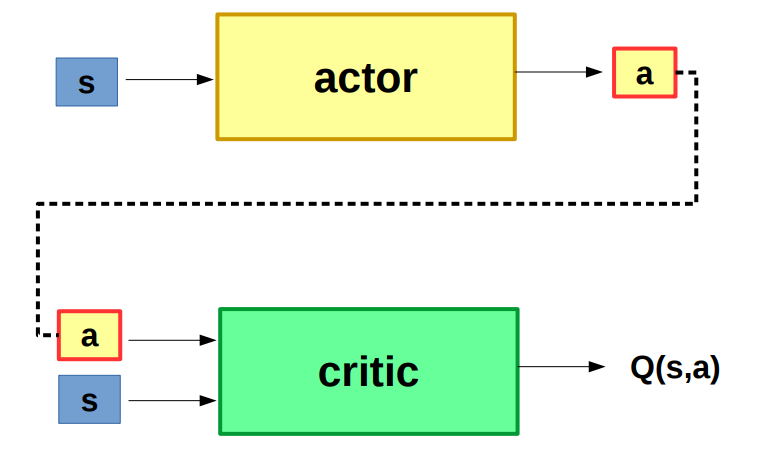

# Deep Reinforcement Learning - Deep Deterministic Policy gradient - Torcs Self-driving Car

[](http://www.youtube.com/watch?v=XyvOfroVIwg)

### Requirements:
- Torcs - [Download and Instructions](https://github.com/djo10/gym-torcs)


### Install
```
git clone https://github.com/djo10/deep-rl-ddpg-self-driving-car.git
cd deep-rl-ddpg-self-driving-car

virtualenv -p python2 --no-site-packages env
source env/bin/activate
pip install -r requirements.txt
```

### Run

```
Usage:
    python ddpg.py [-t TRAIN]
    
Options:
    -t TRAIN, --train TRAIN
                train indicator [default: 0]
```


## Deep Deterministic Policy gradient 




## Credits

- [Continuous Control With Deep Reinforcement Learning](https://arxiv.org/pdf/1509.02971v2.pdf)
- [Deterministic Policy Gradient Algorithms](http://proceedings.mlr.press/v32/silver14.pdf)
- [DDPG Torcs](https://yanpanlau.github.io/2016/10/11/Torcs-Keras.html)
- [Torcs Manual](https://arxiv.org/pdf/1304.1672.pdf)
